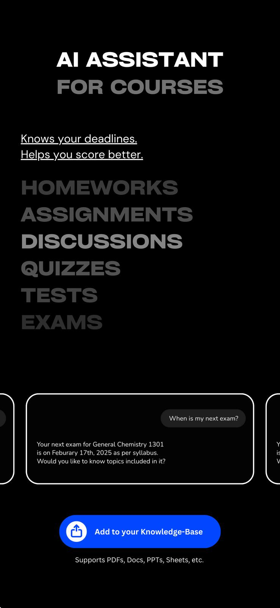
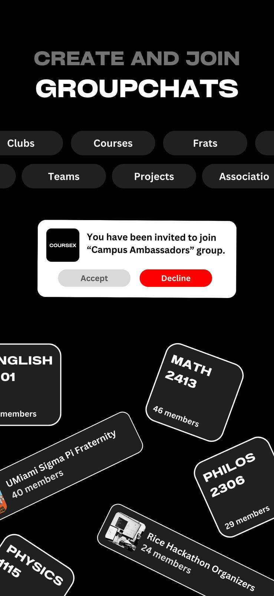

# 🚀 Real-time Scalable Chat App

A feature-rich, scalable real-time chat application built using modern technologies like Socket.io, Redis, Kafka, and more. Designed to handle real-time communication, media uploads, and efficient message delivery at scale.

## 📌 Features

- 🧑‍🥝 Group chat and direct messaging support
- 🖼️ Image and voice message support
- 🔔 Real-time notifications using Socket.io
- 🔄 Real-time message delivery and status updates
- 🔗 Group joining via invite link
- 🌐 RESTful APIs with Express.js
- 🗃️ Efficient image uploading with Cloudinary/S3
- 📤 Optimized image size before upload
- 📥 Message retry logic with removal on failure
- 💾 Redis caching and pub/sub for real-time updates
- 📩 Kafka-based message queue for scalability
- 🧠 Scalable architecture with Docker support

## 🛠️ Tech Stack

- **Frontend**: React Native
- **Backend**: Node.js, Express.js
- **Real-time**: Socket.io, Redis Pub/Sub
- **Queueing**: Apache Kafka
- **Image Upload**: Cloudinary / AWS S3
- **Database**: MongoDB (with Mongoose)
- **Caching**: Redis
- **Deployment**: Docker

## 💡 System Design Highlights

- Real-time communication powered by **Socket.io** and **Redis Pub/Sub**, ensuring low latency and reliability.
- Kafka is used as the core **message broker**, decoupling services and supporting asynchronous processing.
- Redis serves both as a **cache layer** for fast data access and a **pub/sub service** for room/user-level events.
- Efficient retry and cleanup logic for failed image uploads to maintain UI and backend consistency.
- Modular and extensible design with support for horizontal scaling using containerized services.

## ⚙️ Additional Expertise

- Deep hands-on experience with **Kafka**, designing topic-based systems for asynchronous task handling and fault tolerance.
- Used **Redis** not only as a cache but extensively for **pub/sub messaging** to power scalable real-time features.
- Built real-time user experiences using **Socket.io**, efficiently managing connections, rooms, and broadcast strategies.

## 📸 Screenshot

>  >  > 

## 🧪 Testing & Monitoring

- Integrated API testing and socket testing for stable releases
- Logging and error tracking integrated for production readiness

## 📦 Getting Started

1. Clone the repo
2. Install dependencies
3. Configure `.env` file for Redis, Kafka, MongoDB, Cloudinary/S3
4. Run using Docker Compose or individually

## 🤝 Contributing

PRs and suggestions are welcome!

## 📄 License

MIT
